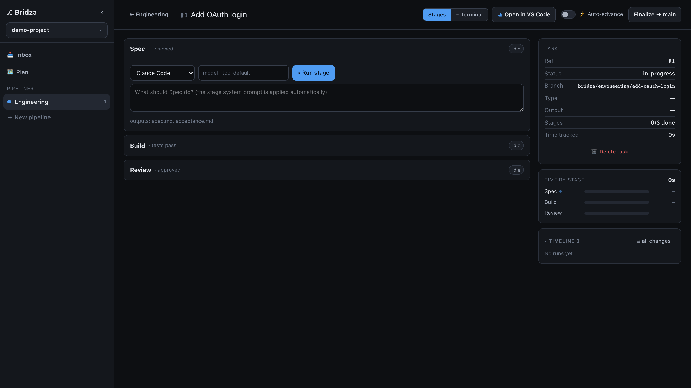
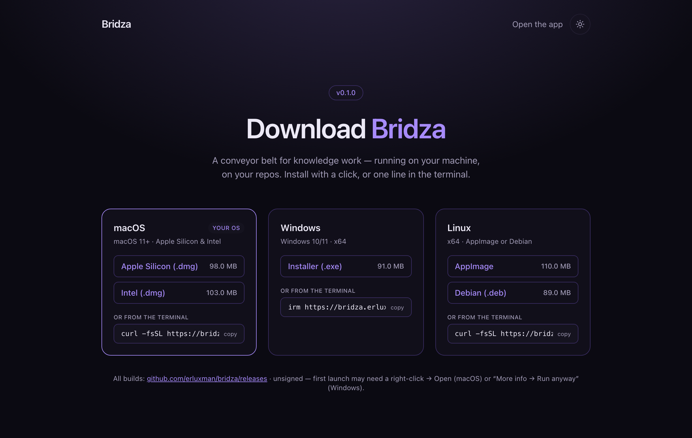

<div align="center">


# Bridza

### A conveyor belt for knowledge work.

Any project — a feature, a video, a campaign, a research inquiry — moves down a
pipeline of small, reviewable stages. Each stage reads only the previous stage's
outputs, runs an AI tool (plus optional shell commands) under its own system
prompt, and hands off clean artifacts to the next. **On your machine, on your
repos, backed by git.**

<br/>

[](https://bridza.erluxman.dev/download)
&nbsp;
[](https://github.com/erluxman/bridza/releases/latest)


<br/>



</div>

<br/>

## Why Bridza

The promise is **minimal change per stage**: a human reviewer sees one small,
focused diff at each handoff — never a 20-file dump. That's possible because
Bridza treats work as pure functions over git:

- 🧩 **Stages are pure functions.** A stage's input is *only* the previous
  stage's named output artifacts — never the original brief. Every handoff is
  clean, every artifact traceable, any single stage re-runnable in isolation.
- 🌿 **Git is the database.** Each task gets its own branch + worktree
  (`bridza/<pipeline>/<task>`). Runs commit as they go, so the timeline *is* the
  history. Your working tree and `HEAD` are never touched.
- 🗂 **A stage is fully defined by data.** Preceding stage + outputs + system
  prompt + editable user prompt (+ commands + automation + gate). *Types* of
  work aren't code — they're configuration you can build in-product.
- 🤖 **Bring your own AI CLI.** Runs [Claude Code](https://claude.com/claude-code),
  [opencode](https://opencode.ai), or any tool on your `PATH`. Swap models
  without rewiring.
- 👤 **Human-in-the-loop by default, autonomous by opt-in.** Every stage is
  Supervised until you flip **Automate**.

## Install

Bridza is a desktop app for **macOS, Windows, and Linux** — both a click-to-install
download and a one-line terminal install.

### Download

Grab the installer for your OS at **[bridza.erluxman.dev/download](https://bridza.erluxman.dev/download)**
or from the [latest GitHub release](https://github.com/erluxman/bridza/releases/latest).

<div align="center">

</div>

### Terminal

```bash
# macOS + Linux
curl -fsSL https://bridza.erluxman.dev/install.sh | sh
```

```powershell
# Windows (PowerShell)
irm https://bridza.erluxman.dev/install.ps1 | iex
```

Both scripts pull the latest release, pick the right artifact for your OS/arch,
and install it — macOS → `/Applications`, Linux → `~/.local/bin/bridza`,
Windows → silent installer.

> Builds are currently **unsigned**. First launch: macOS → right-click → **Open**;
> Windows → **More info → Run anyway**. The macOS script clears the quarantine
> flag for you.

## How it works

The desktop app **is** a local bridge. It starts a loopback HTTP server that
serves the built UI *and* mounts a `/api/bridza/*` surface with real filesystem
+ git access to your repos — the exact same bridge the dev server uses. No cloud
round-trip; your code never leaves your machine.

```
┌─ Electron ─────────────────────────────────────────────┐
│  BrowserWindow ──▶ http://127.0.0.1:<port>             │
│                     ├─ dist/           (React UI)       │
│                     └─ /api/bridza/*   (the bridge)     │
│                          └─ fs · git · PTY · AI CLIs    │
└────────────────────────────────────────────────────────┘
        one bridge  ·  server/bridge.js  ·  dev + desktop
```

`server/bridge.js` is the single source of truth for the API, consumed by both
the Vite dev plugin (`server/bridza-fs.js`) and the packaged app
(`electron/main.js`). See **[docs/10-desktop-app.md](docs/10-desktop-app.md)**.

## Develop

Requires **Node ≥ 25** (pinned in [`.nvmrc`](.nvmrc)) and **pnpm**.

```bash
pnpm install
pnpm dev            # web app at http://localhost:5173  (app at /app)
```

Run the desktop app locally:

```bash
pnpm desktop        # build the UI + launch Electron
```

## Build & release

```bash
pnpm build          # web bundle → dist/
pnpm desktop:dist   # installers → release/  (no publish)
pnpm test           # unit tests (Vitest)
pnpm test:e2e       # end-to-end (Playwright)
```

Installers are hosted on **GitHub Releases**. Cutting a release is tag-driven —
[`.github/workflows/release.yml`](.github/workflows/release.yml) builds on
macOS/Windows/Linux runners and publishes all artifacts:

```bash
git tag v0.1.0 && git push origin v0.1.0
```

## Tech stack

| | |
|---|---|
| **Desktop** | Electron 33 · electron-builder |
| **UI** | React 19 · TypeScript · Tailwind CSS v4 · Vite |
| **Bridge** | Node (fs · git plumbing · node-pty · ws) |
| **Landing + download** | Cloudflare Pages → [bridza.erluxman.dev](https://bridza.erluxman.dev) |
| **CI/CD** | GitHub Actions (deploy + release) |

## Contributing

Issues and PRs welcome — see **[CONTRIBUTING.md](CONTRIBUTING.md)**. Product
context lives in [`docs/`](docs/) (vision, PRD, edge cases, roadmap).

## License

[MIT](LICENSE) © erluxman
