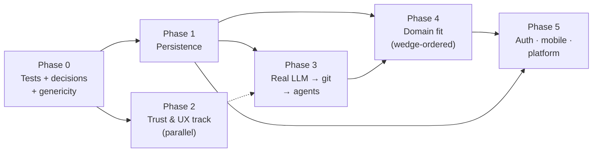

# Stagepipe — Build Flow & Dependency Routes

How the remaining work gets built, in what order, and why. Node IDs reference
[05-backlog-and-roadmap.md](05-backlog-and-roadmap.md); statuses live in
[00-progress-tracker.md](00-progress-tracker.md).

Three kinds of nodes:
- **Decision** (diamond) — costs a conversation, not code; but it *gates* builds.
- **Build** (box) — engineering work.
- **Done** (rounded) — the current app, the foundation everything sits on.

## Master dependency graph

```mermaid
flowchart TD
  APP(["✅ Current app — UI complete,<br/>engine simulated (84 reqs done)"])

  %% ───────────────── Phase 0 — safety net & decisions ─────────────────
  subgraph PH0["Phase 0 · Safety net & decisions (all parallel)"]
    TESTS["P0-2 Automated tests<br/>(pure engine units first: conveyor,<br/>diff, resolveStages — then e2e)"]
    IDS["P0-5 ID generation hardening"]
    GEN["P1-13 Engine genericity fixes<br/>(dynamic modeIds, no 'video'<br/>fallback, cost → type data)"]
    D6{"D-6 Persistence model<br/>local-first vs server-first"}
    D1{"D-1 Pick the wedge<br/>(creator/dev first?)"}
    DSYNC{"EC-X-02 Board↔belt<br/>stage-sync rule"}
    DDEL{"EC-SM-07 Stage-deletion<br/>rule for occupied stages"}
    D4{"D-4 Metrics identity<br/>(cost: telemetry or user-facing)"}
    DMOB{"P3-1 Mobile strategy<br/>(resurrect view vs responsive web)"}
  end

  %% ───────────────── Phase 1 — durability ─────────────────
  subgraph PH1["Phase 1 · Durability"]
    PERS["P0-1 Persistence layer<br/>(cards, runtime types, workspace<br/>pipelines, folders, inbox)"]
  end

  %% ───────────────── Phase 2 — trust & UX (parallel with Phase 1) ─────
  subgraph PH2["Phase 2 · Trust & UX hardening (parallel track)"]
    BRIEF["P1-1 Always-inspectable<br/>brief drawer"]
    COPY["P1-2 Provenance copy reframe<br/>(ships with brief drawer)"]
    NCS["P1-3 Non-color status pass"]
    ADV["P1-4 One primary advance action"]
    CMDK["P1-6+7 Real ⌘K palette,<br/>wire-or-hide dead chrome"]
    KEY["P1-9 GUI keyboard support"]
    ORIENT["P1-10 Type-switch orientation cue"]
    SYNC["P1-11 Board↔belt stage sync"]
    DELB["P1-12 Stage-deletion handling"]
    REPAR["P2-9 Drag-reparent subtasks"]
  end

  %% ───────────────── Phase 3 — real integrations ─────────────────
  subgraph PH3["Phase 3 · Real integrations (demo → product)"]
    LLM["P0-3 Real LLM behind Generate<br/>(wedge type first; simulator<br/>stays as offline mode)"]
    GIT["P0-4 Real file/git/terminal<br/>(branch per card, cmd.shell)"]
    AGENTS["Agent picker becomes real<br/>(supersedes P2-10 fake transcripts)"]
    ERRUX["P1-5 Full generation error UX<br/>(real timeouts, partials,<br/>'looks wrong' → prompt feedback)"]
    REFLOW["P2-16 'Looks wrong' reopens<br/>prev stage + re-flows diffs/time"]
    GUIDE["P1-8 First-run guided pipeline"]
  end

  %% ───────────────── Phase 4 — domain fit ─────────────────
  subgraph PH4["Phase 4 · Domain fit (order set by D-1)"]
    LOOPS["P2-1 Feedback loops<br/>(Measure→next Brief,<br/>Closed-won→renewal, Released→next)"]
    METRICS["P2-6 Outcome metrics per type<br/>(velocity / win rate / ROAS)"]
    ROLLUP["P2-7 Cross-ticket time rollup"]
    EST["P2-8 Estimates vs actuals"]
    SALES["P2-2 Sales back-transitions,<br/>stalled states, threads"]
    FORECAST["P2-3 Weighted pipeline<br/>+ forecast view"]
    ASSETS["P2-4 Marketing asset library<br/>(many-to-many)"]
    BRAND["P2-5 Brand kit +<br/>multi-party approval"]
    FILEREV["P2-15 Per-file review<br/>(comment/approve per file)"]
  end

  %% ───────────────── Phase 5 — platform ─────────────────
  subgraph PH5["Phase 5 · Platform expansion"]
    AUTH["P3-5 Auth / multi-user / roles"]
    RESP["P3-1/2/3 Mobile or responsive<br/>(+ voice capture if resurrected)"]
    TUICAP["P3-4 TUI capture command"]
  end

  %% ── edges: foundation
  APP --> TESTS
  APP --> IDS
  TESTS --> GEN

  %% ── edges: into persistence
  TESTS --> PERS
  GEN -->|registry must be dynamic<br/>before persisting runtime types| PERS
  IDS -->|ids become durable keys| PERS
  D6 --> PERS
  DSYNC -->|settle card-stage semantics<br/>before freezing schema| SYNC
  SYNC --> PERS
  DDEL --> DELB
  DELB -->|schema must survive<br/>stage deletion| PERS

  %% ── edges: trust & UX (cheap, parallel)
  TESTS --> BRIEF
  BRIEF --> COPY
  TESTS --> NCS
  TESTS --> ADV
  TESTS --> CMDK
  TESTS --> KEY
  TESTS --> ORIENT
  TESTS --> REPAR

  %% ── edges: integrations
  D1 -->|which type gets<br/>real AI first| LLM
  PERS -->|runs/outputs must<br/>be storable| LLM
  LLM --> GIT
  LLM --> AGENTS
  LLM --> ERRUX
  ERRUX --> REFLOW
  PERS --> GUIDE
  LLM -.->|guide is more honest<br/>with real generation| GUIDE

  %% ── edges: domain fit
  PERS --> LOOPS
  PERS --> ASSETS
  PERS --> FILEREV
  PERS --> ROLLUP
  D4 --> METRICS
  PERS --> METRICS
  ROLLUP --> EST
  SYNC -->|belt must support<br/>non-forward moves| SALES
  SALES --> FORECAST
  METRICS --> FORECAST
  ASSETS --> BRAND
  AUTH -->|roles needed for<br/>multi-party gates| BRAND

  %% ── edges: platform
  PERS -->|server-first prerequisite| AUTH
  DMOB --> RESP
  APP --> TUICAP
```

## Critical path

**Tests → genericity fixes → persistence → real LLM → real git/terminal.**

Everything else hangs off this spine:
1. **P0-2 tests** come first because every later step refactors load-bearing
   code (`useConveyor`, the diff engine, the data registry). The engine is
   pure functions — cheap to unit-test now, expensive to debug later.
2. **P1-13 genericity** before persistence: if `modeIds` stays static and the
   registry can't be extended cleanly, persisted runtime types would load into
   a registry that can't represent them.
3. **P0-1 persistence** before real LLM: real generations cost money — losing
   their outputs on reload is unacceptable in a way that losing fake ones isn't.
4. **P0-3 LLM** before **P0-4 git**: file changes are downstream of generation
   in the product's own model (a stage generates → artifacts land on a branch).

## Parallel routes (what never blocks on the spine)

- **Trust & UX track** (Phase 2): brief drawer → copy reframe, non-color
  status, one-primary-action, ⌘K palette, keyboard pass, orientation cue,
  drag-reparent. All UI-local; only test coverage is a prerequisite. Run this
  track *while* persistence is being built.
- **Decisions** (Phase 0 diamonds) cost meetings, not code — make them all
  up front so no build ever idles waiting on one. The two that bite earliest:
  **D-6** (persistence model) and **EC-X-02** (board↔belt sync — it freezes
  the card-state schema).
- **TUI capture** and similar delighters can slot into any idle gap.

## Dependency table (one line per build)

| Build | Hard dependencies | Soft (better-after) | Unblocks |
|---|---|---|---|
| P0-2 Tests | — | — | safe refactors everywhere |
| P0-5 ID hardening | — | — | persistence keys |
| P1-13 Genericity | tests | — | persistence of runtime types, TUI runtime tabs |
| P1-11 Stage sync | EC-X-02 decision | tests | persistence schema, sales back-transitions |
| P1-12 Stage-deletion handling | EC-SM-07 decision | tests | persistence schema |
| P0-1 Persistence | D-6, tests, P1-13, P0-5, P1-11, P1-12 | — | LLM, loops, assets, metrics, rollup, file-review, guide, auth |
| P1-1 Brief drawer | — | tests | P1-2 copy reframe |
| P1-2 Copy reframe | P1-1 (same PR per design) | — | honest marketing surface |
| P1-3 Non-color status / P1-4 one action / P1-6+7 ⌘K / P1-9 keyboard / P1-10 orientation / P2-9 reparent | — | tests | — (quality) |
| P0-3 Real LLM | D-1, persistence | error-UX groundwork | git, agents, error UX, reflow |
| P0-4 Git/terminal | LLM | wedge = dev | real Dev-type product |
| Agents real | LLM | — | retires P2-10 |
| P1-5 Error UX (full) | LLM | — | P2-16 reflow |
| P2-16 Looks-wrong reflow | P1-5 | — | review loop completeness |
| P1-8 First-run guide | persistence | LLM | onboarding |
| P2-1 Loops | persistence | — | cycle-based marketing story |
| P2-6 Outcome metrics | D-4, persistence | — | P2-3 forecast |
| P2-7 Rollup | persistence | metrics | P2-8 estimates |
| P2-8 Estimates vs actuals | rollup | — | — |
| P2-2 Sales states | P1-11 stage sync | — | P2-3 forecast |
| P2-3 Forecast | P2-2, P2-6 | — | sales wedge |
| P2-4 Asset library | persistence | — | P2-5 brand kit |
| P2-5 Brand kit + multi-party | P2-4, P3-5 auth | — | marketing wedge |
| P2-15 Per-file review | persistence | git integration | review depth |
| P3-5 Auth/multi-user | persistence (server) | — | P2-5, collaboration |
| P3-1/2/3 Mobile/responsive | DMOB decision | core stable | mobile users |
| P3-4 TUI capture | — | — | — (delighter) |

## Reading the phases as a timeline

Phase 2 deliberately overlaps Phases 1 and 3 — it's the always-available
parallel lane. Phase 4's internal order is set by the D-1 wedge decision:
dev wedge → loops/metrics/rollup first; marketing wedge → assets/brand first;
sales wedge → sales-states/forecast first.
