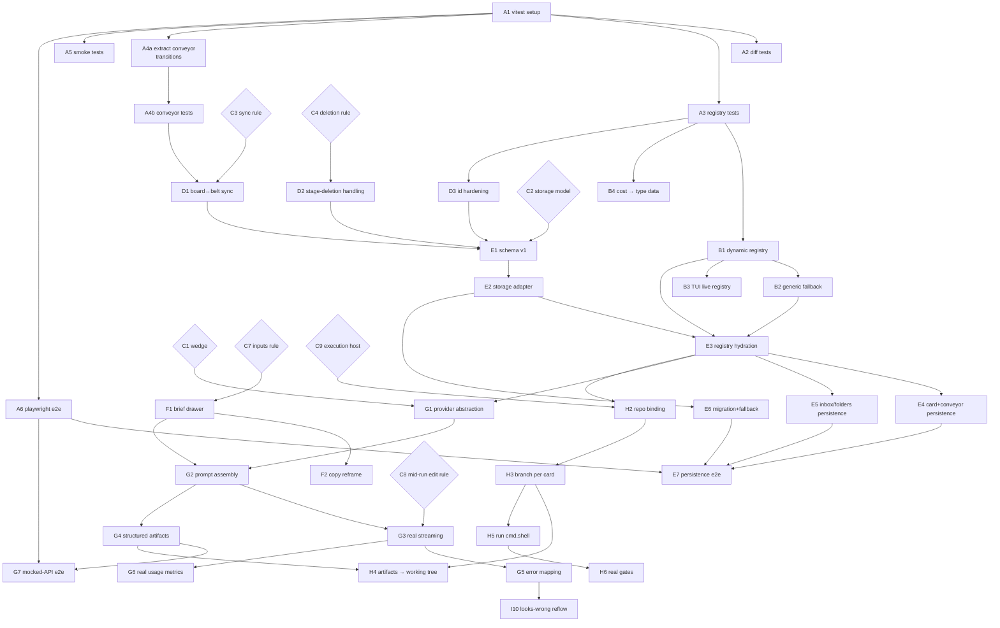

# Stagepipe — Task-Level Build Plan

Every feature from [07-build-flow.md](07-build-flow.md) decomposed into
engineering tasks. Each task: what to build, which files it touches, its
acceptance criteria (AC — referencing test cases in
[03-test-cases.md](03-test-cases.md) where they exist), hard dependencies, and
a size (S < ½ day · M = 1–2 days · L = 3–5 days).

Task IDs: `<workstream>-<n>` (A1, E4, …). A task is *ready* when all its deps
are done. Update [00-progress-tracker.md](00-progress-tracker.md) as tasks
land.

---

## WS-A · Test harness (P0-2)

| ID | Task | Spec / AC | Files | Deps | Size |
|---|---|---|---|---|---|
| A1 | Vitest setup | Add vitest + jsdom + @testing-library/react; `npm test` runs; CI-able script. AC: one passing smoke test. | package.json, vite.config.js, new `src/__tests__/` | — | S |
| A2 | Diff-engine unit tests | Cover `lineDiff`, `wordDiff`, `diffStats`, `mutate`, `buildChain`: identical inputs → no ops; insert/delete/replace cases; word-level marks; mutate always produces ≥1 change and rolls baseline; buildChain gates on completed stages (FR-DIF-5). | `src/pms-files.jsx` (export pure fns), tests | A1 | M |
| A3 | Registry unit tests | Cover `makeType`, `registerType`, `addChannel`, `resolveStages` (inherit vs fork), `hasOwnStages`, `stageSources`, `archiveChannel`, `groupChannels`/folder ops (dissolve <2, move-out), `makeCard` shape. | `src/pms-data.jsx`, tests | A1 | M |
| A4a | Extract conveyor transitions | Refactor `useConveyor` so state transitions (generate-start/stream/finish, approve, fail, retry, stale-cascade, auto-run step) are a pure function `(state, event) → state` the hook wraps. No behavior change. | `src/pms-runner.jsx` | A1 | M |
| A4b | Conveyor unit tests | Drive the pure transitions: approve advances + hands outputs; cascade flips only approved/stale downstream (EC-GEN-08); failFirst halts auto-run even when `auto` (TC-GEN-11); supervised pause (TC-GEN-09); retry path; final-stage approve (EC-GEN-01); regen-while-streaming rule (EC-GEN-02 — define it here). | tests | A4a | M |
| A5 | Component smoke tests | Render `<App/>` per registered type; assert one column per stage from data (TC-CORE-01 generic form); open card detail; no errors. | tests | A1 | S |
| A6 | Playwright e2e | Codify already-verified flows: composer create (TC-BRD-01), drag move (TC-BRD-03), inbox promote (TC-INB-03), generate→approve (TC-GEN-04/05), settings persist (TC-SET-05), GUI↔TUI (TC-TUI-01). | new `e2e/` | A1 | L |

Route: A1 → {A2, A3, A4a, A5, A6}; A4a → A4b.

## WS-B · Engine genericity (P1-13)

| ID | Task | Spec / AC | Files | Deps | Size |
|---|---|---|---|---|---|
| B1 | Dynamic type registry | Replace static `modeIds: [...]` with a getter over `Object.keys(TYPES)`; `registerType` needs no extra step; expose a `typesChanged` subscription (simple event or rev counter) so shells can re-render. AC: A3 tests green; new type visible everywhere without manual `typeOrder` bookkeeping. | `src/pms-data.jsx`, `src/App.jsx` (drop `typeOrder` state or derive it), `src/pms-board.jsx:113` | A3 | M |
| B2 | First-registered-type fallback | `App.jsx:43` and TUI `initialMode`: stale saved mode → `modeIds[0]`, never `"video"`. AC: deleting any seed template from data leaves app booting (PRD FR-CORE-6 acceptance); EC-ST-01 updated. | `src/App.jsx`, `src/pms-tui.jsx` | B1 | S |
| B3 | TUI reads live registry | `pms-tui.jsx:345-356` seeds cards/channels/typeOrder from `modeIds` at mount — derive from registry + re-seed when a type registers. AC: TC-CORE-05 TUI tab check passes. | `src/pms-tui.jsx` | B1 | S |
| B4 | Cost field into type data | Remove `mode === "video"` branch in `makeCard` (`pms-data.jsx:726`); add `costZero`/`costSeed` to type meta; builder sets it. AC: grep `=== "video"` in engine code returns nothing. | `src/pms-data.jsx`, `src/pms-builder.jsx` | A3 | S |

Route: A3 → B1 → {B2, B3}; A3 → B4.

## WS-C · Decisions (gates, not code)

Each produces a one-page ADR in `docs/adr/`. All can be made in one session.

| ID | Decision | Options on the table | Blocks |
|---|---|---|---|
| C1 | Wedge (D-1) | creator/dev first · all-equal | G1 (which type gets real AI), WS-I ordering |
| C2 | Storage model (D-6) | localStorage-only v1 · local-first w/ sync schema · server-first | E1 |
| C3 | Board↔belt sync rule (EC-X-02) | column drag sets belt stage (recommended) · independent axes · one-way | D1, E1, I5 |
| C4 | Stage-deletion rule (EC-SM-07) | block while occupied · auto-move cards to predecessor (recommended) · orphan bucket | D2, E1 |
| C5 | Metrics identity (D-4) | cost = hidden telemetry · user-facing per type | I2 |
| C6 | Mobile strategy (P3-1) | responsive web (recommended) · resurrect phone-frame view · native later | J4 |
| C7 | Non-adjacent inputs (EC-X-03) | allow + show provenance (recommended; schema already supports) · strict prev-only, lock builder | F1 copy, SM editor copy |
| C8 | Stage edit during in-flight run (EC-X-01 / D-5) | block edit while running · cancel run on edit (recommended) · queue edit | D2, G3 |
| C9 | Execution host for shell/git | local companion daemon · Tauri/Electron desktop · server runners | H1+ |

## WS-D · Pre-persistence consistency builds

| ID | Task | Spec / AC | Files | Deps | Size |
|---|---|---|---|---|---|
| D1 | Board↔belt stage sync | Per C3: `moveCard` also updates the card's conveyor active stage; belt approve calls back to move the card's column (today `App.moveCard` and `useConveyor` are unconnected). One source of truth: `card.stage`. AC: EC-BRD-07 closed; drag to "QA" then open card → belt is on QA; approve last belt stage → card lands in done column. | `src/App.jsx`, `src/pms-runner.jsx`, `src/pms-detail.jsx` | C3, A4b | M |
| D2 | Stage-deletion handling | Per C4 in Stage Manager delete + Reset flows: occupied stage → dialog (move N cards to *predecessor* / cancel). Also covers workspace pipeline Reset when cards sit in forked-only stages. AC: TC for EC-SM-07; no orphan `card.stage` ids possible. | `src/pms-stageflow.jsx`, `src/pms-data.jsx` | C4, A3 | M |
| D3 | ID & ref hardening | Replace `Date.now()`-based ids (`makeCard`, `addChannel`, folder ids `pms-data.jsx:809`) with `crypto.randomUUID()`; card refs become per-workspace monotonic (`LZ-205`, `LZ-206` — store counter on channel). AC: 1000 rapid creates → zero collisions (unit test); refs stay human-readable. | `src/pms-data.jsx` | A3 | S |

Route: C3→D1 (also A4b); C4→D2; D3 independent after A3.

## WS-E · Persistence (P0-1)

| ID | Task | Spec / AC | Files | Deps | Size |
|---|---|---|---|---|---|
| E1 | Schema v1 + ADR | Versioned envelope `{v:1, settings, types, channels, folders, archived, cards, inbox, conveyor}`. Types serialize *whole* (built-ins included, so seed edits persist); workspace forks under `channel.stages`; conveyor per card: stage statuses, edited prompts, outputs, run #, time-by-stage. Explicitly exclude: streaming buffers, flash/toast state. | `docs/adr/`, new `src/store/schema.js` | C2, C3, C4, D3 | M |
| E2 | Storage adapter | `loadState() / saveState(patch) / subscribe()`; localStorage impl, debounced writes (≤1/s), size guard (~4 MB warn), export/import JSON file for backup. Interface stays storage-agnostic for a later server impl. | new `src/store/` | E1 | M |
| E3 | Registry hydration | On boot: hydrate TYPES/CHANNELS/CARDS/folders/archived from store **through** `registerType` (needs B1); seed from `pms-data` defaults only on first run. Runtime types and Stage-Manager edits survive reload (closes FR-CORE-8 and FR-SM-7 limitations). | `src/pms-data.jsx`, `src/store/`, `src/main.jsx` | E2, B1, B2 | L |
| E4 | Card + conveyor persistence | Lift `cardsByMode` / conveyor state writes into the store; `useConveyor` persists per-card state keyed by card id (today it resets per mount); per-stage tracked time accrues durably. AC: reload mid-pipeline → same stage statuses, outputs, times; TC-DIF views identical after reload. | `src/App.jsx`, `src/pms-runner.jsx`, `src/pms-detail.jsx` | E3, D1 | L |
| E5 | Inbox / folders / archive persistence | Promote removes durably; folder membership + archived sets per type survive reload. | `src/App.jsx`, `src/pms-board.jsx` (WorkspaceList) | E3 | S |
| E6 | Migration + corruption fallback | Unknown `v` → migrate chain; corrupt JSON → back up raw blob, reset to seeds, toast "restored defaults (backup saved)". AC: unit tests for v-skip and garbage input; EC-ST-02 stays green. | `src/store/` | E2 | S |
| E7 | Persistence e2e | Playwright: create type → fork pipeline → run 2 stages → archive a workspace → reload → all intact. | `e2e/` | E4, E5, E6, A6 | M |

Route: E1→E2→E3→{E4, E5}; E2→E6; {E4,E5,E6}→E7.

## WS-F · Trust & UX track (parallel — only A-tests required)

| ID | Task | Spec / AC | Files | Deps | Size |
|---|---|---|---|---|---|
| F1 | Brief drawer (P1-1) | `card.brief` field (seeded from `card.notes`/inbox text at creation); slide-over from belt header + SM toolbar + rail; read-only; per C7, show "referenced the brief" provenance marker if a stage prompt cites it. | `src/pms-data.jsx`, `src/pms-runner.jsx`, `src/pms-detail.jsx`, `src/pms-stageflow.jsx` | C7 | M |
| F2 | Copy reframe (P1-2) | Same PR as F1 (design rule): belt input caption, cascade banner, board tagline → handoff/provenance wording; kill any "AI closes it" implication. | strings across runner/detail/board | F1 | S |
| F3 | Non-color status (P1-3) | Status icon set (✓ ◆ ◌ ▲ ·) rendered beside color everywhere status appears: stepper, rail, board card badges, SM nodes, TUI already compliant. AC: grayscale screenshot still fully readable. | `src/pms-ui.jsx` (statusIcon), runner/board/detail/stageflow | — | M |
| F4 | One primary action (P1-4) | Keep belt button as primary; rail button becomes compact "shortcut" with identical label + tooltip "mirrors the belt action", or remove per design review. | `src/pms-detail.jsx` | — | S |
| F5 | ⌘K command palette (P1-6) | Command registry: new card (stage-aware), jump to workspace/type/view, toggle TUI/theme, open settings; fuzzy match; recent-first; replaces decorative search box. | new `src/pms-palette.jsx`, `src/pms-board.jsx` (topbar) | B1 (lists live types) | L |
| F6 | Wire-or-hide chrome (P1-7) | Filter → working stage/type/tag filter on board; Group → by stage (current) / by type tag; bell + avatar → remove until J-track. | `src/pms-board.jsx` | — | M |
| F7 | GUI keyboard pass (P1-9) | Board: arrows move focus, enter opens, n = new (parity with TUI); belt: ←/→ stage, g/a generate/approve; esc closes detail/drawer; visible focus rings. | board/detail/runner | F5 (shared key handling) | M |
| F8 | Orientation cue (P1-10) | On type switch: brief header transition naming type + workspace ("Dev · Lazy Launcher"), and the sidebar section label flashes. | `src/App.jsx`, `src/pms-board.jsx` | — | S |
| F9 | Drag-reparent subtasks (P2-9) | Drag a row in the subtask tree onto another → reparent (cycle-guard: can't drop on own descendant); persist once E4 lands. | `src/pms-detail.jsx` | — | M |

Route: C7→F1→F2; F5→F7; F3/F4/F6/F8/F9 independent.

## WS-G · Real LLM (P0-3)

| ID | Task | Spec / AC | Files | Deps | Size |
|---|---|---|---|---|---|
| G1 | Provider abstraction + settings | `generateStage(ctx, onToken) → {artifacts, usage}` interface; Anthropic impl (key in settings panel, stored via store; never in repo); "Demo mode" keeps the simulator behind the same interface. | new `src/llm/`, `src/tweaks-panel.jsx` section | C1, E3 | M |
| G2 | Prompt assembly contract | Build messages from stage data: `stage.sys` + serialized input artifacts (+ brief if cited per C7) + user prompt + attachments; unit-test the assembled prompt for two templates. | `src/llm/`, `src/pms-runner.jsx` | G1, F1 | M |
| G3 | Streaming into the belt | Real token stream drives the existing streaming UI; cancel on Stop/card close (fixes EC-GEN-02/03 for real); respect C8 rule on stage edits mid-run. | `src/pms-runner.jsx`, `src/llm/` | G2, C8 | M |
| G4 | Structured artifact output | Stage outputs requested as named artifacts (tool-use / JSON contract matching `stage.outputs`); parsed into the files engine so diffs are real model output. AC: a Dev Planning run yields spec.md + acceptance.md contents from the model. | `src/llm/`, `src/pms-files.jsx` | G2 | L |
| G5 | Real error mapping (completes P1-5) | API timeout/429/refusal/parse-failure → existing typed failure states; retry w/ backoff; "Looks wrong" captures a reason → appended to regenerate prompt (feeds I10). | `src/llm/`, `src/pms-runner.jsx` | G3 | M |
| G6 | Real usage metrics | Tokens/cost/exchanges from API usage populate the AI activity log + rail cost (per C5 visibility). | `src/pms-runner.jsx`, `src/pms-detail.jsx` | G3, C5 | S |
| G7 | Mocked-API e2e | Playwright with a stub LLM server: full generate→approve→cascade on real code path. | `e2e/` | G4, A6 | M |

Route: C1+E3→G1→G2→G3→{G4? no: G2→G4}, G3→G5→(I10), G3→G6; {G4,A6}→G7. (G4 parallel to G3 after G2.)

## WS-H · Git / terminal execution (P0-4)

| ID | Task | Spec / AC | Files | Deps | Size |
|---|---|---|---|---|---|
| H1 | Execution-host ADR (C9) | Local companion daemon vs desktop shell vs server runners; security model for `cmd.shell`. | docs/adr | C9 | — |
| H2 | Workspace→repo binding | Workspace settings: repo path/url, base branch; stored in schema (E1 ext). | store, sidebar settings | H1, E3 | M |
| H3 | Branch per card | First generate on a card → create `card.branch` from base; belt shows real branch. | host bridge, runner | H2 | M |
| H4 | Apply artifacts to working tree | G4 artifacts written as files on the branch; diffs in FilesDiff come from `git diff` instead of the simulator (simulator remains demo mode). | host bridge, `src/pms-files.jsx` | H3, G4 | L |
| H5 | Run `cmd.shell` | Execute stage shell commands on the host with streamed output into a belt log panel; exit codes recorded. | host bridge, runner | H3 | M |
| H6 | Real gates | Gate definitions map to checks (e.g. "Build green" = shell command exit 0; "Tests pass" = parsed test summary); approve blocked until gate passes or explicit override w/ note. | runner, data schema | H5 | M |

Route: H1→H2→H3→{H4 (needs G4), H5→H6}.

## WS-I · Domain fit (order set by C1)

| ID | Task | Spec / AC | Deps | Size |
|---|---|---|---|---|
| I1 | Feedback loops (P2-1) | Approving a terminal stage offers "Start next cycle" → new card in stage 1, brief prefilled from final outputs (Measure→Brief, Released→next, Closed-won→renewal). | E4 | M |
| I2 | Outcome metrics (P2-6) | `type.metrics[]` definitions (id, label, source expr over cards/stages); board header widgets; cost demoted per C5. | E4, C5 | L |
| I3 | Cross-ticket rollup (P2-7) | Board-level "time by stage across all cards" view; flags systemic bottleneck. | E4 | M |
| I4 | Estimates vs actuals (P2-8) | `stage.estimate` (builder + SM editable); belt + rollup show overrun deltas. | I3 | M |
| I5 | Sales states (P2-2) | Per C3 model: allow backward stage moves w/ reason note, `stalled` status, parallel thread objects on a card. | D1, E4 | L |
| I6 | Forecast view (P2-3) | Weighted pipeline (stage → probability), win rate, velocity per workspace. | I5, I2 | M |
| I7 | Asset library (P2-4) | Asset entity (file + tags + source card); library view per type; attach existing asset as stage input. | E4 | L |
| I8 | Brand kit (P2-5a) | Per-workspace reference docs typed as brand voice/palette; auto-included in marketing prompt assembly. | I7, G2 | M |
| I9 | Per-file review (P2-15) | Comment + approve per file in FilesDiff; stage gate can require all files approved. | E4 | M |
| I10 | Looks-wrong reflow (P2-16) | "Looks wrong" → reopen previous stage option; downstream re-flow uses cascade + G5 reason. | G5 | M |

## WS-J · Platform

| ID | Task | Spec / AC | Deps | Size |
|---|---|---|---|---|
| J1 | Server store impl | Same adapter interface as E2 against an API; sync/conflict per C2. | E2, C2=server | L |
| J2 | Auth + roles (P3-5) | Accounts, workspace membership, role per type (owner/editor/approver). | J1 | L |
| J3 | Multi-party gates (P2-5b) | Gate requires named roles' approvals (brand + legal); approval inbox. | J2, I8 | M |
| J4 | Responsive / mobile (per C6) | Breakpoint pass: sidebar→drawer, board→single-column swipe, belt vertical; or resurrect phone frame from `design_src/.../pm/mobile.jsx` if C6 says so. | C6 | L |
| J5 | TUI capture command (P3-4) | `:capture <text>` in TUI status bar → inbox item. | — | S |

---

## Task-level dependency graph (foundation spine + integrations)

UX track (F3–F9) and domain track (I1–I9, J1–J5) hang off this spine exactly
as tabled above — F-tasks need only A1-era tests (F5 also needs B1), I-tasks
need E4, J3 needs J2+I8.

## Suggested execution order (solo-dev lane)

1. **Sprint 1:** A1 → A3 + A2 (parallel) → B1 → B2/B3/B4, D3. Make C1–C9
   decisions this week (one ADR session).
2. **Sprint 2:** A4a → A4b; D1, D2; E1 → E2 → E6.
3. **Sprint 3:** E3 → E4 + E5 → E7. Slot F3/F4/F8 in review-wait gaps.
4. **Sprint 4:** F1→F2, F5→F7, F6 (the trust/UX burn-down) while G1–G2 start.
5. **Sprint 5–6:** G3→G5/G6, G4→G7 — first real end-to-end generation on the
   wedge type. Then H2→H5 if wedge = dev.
6. **Then:** I-track by wedge; J-track when collaboration demand is real.
