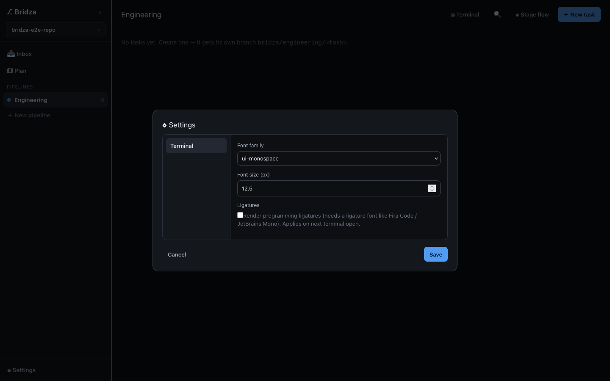
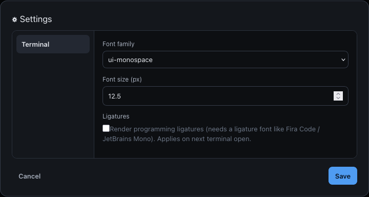
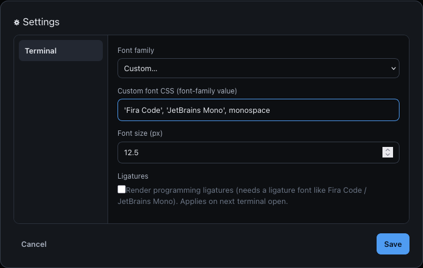
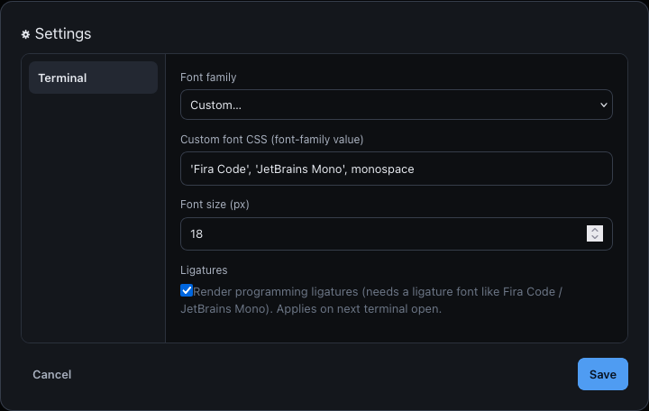
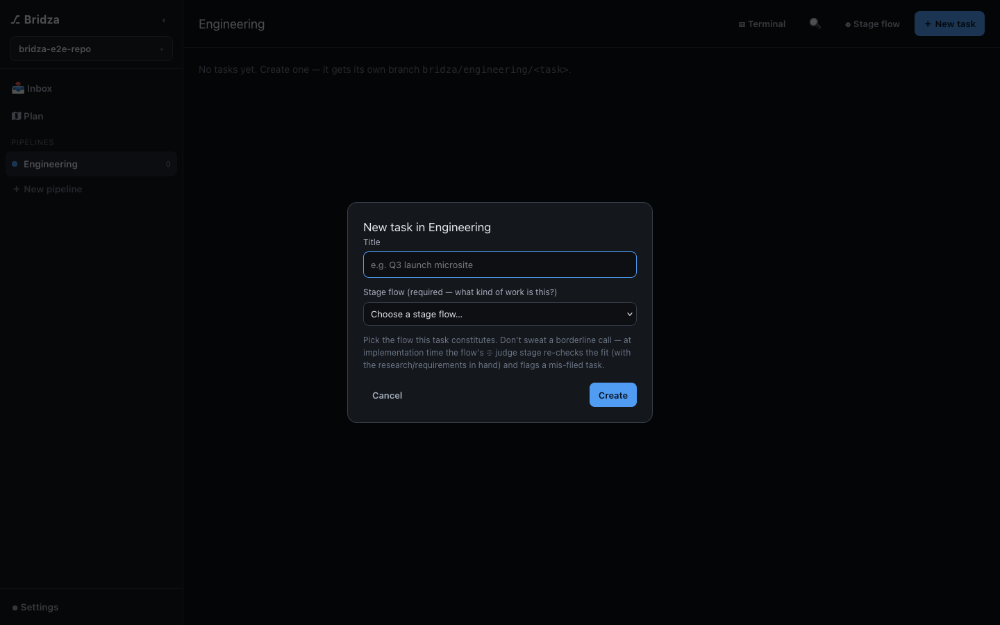
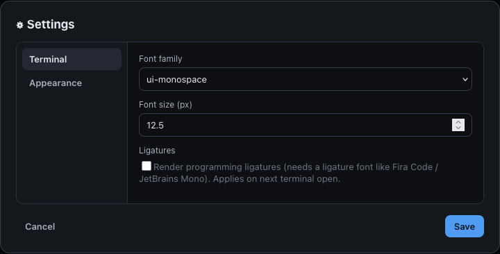
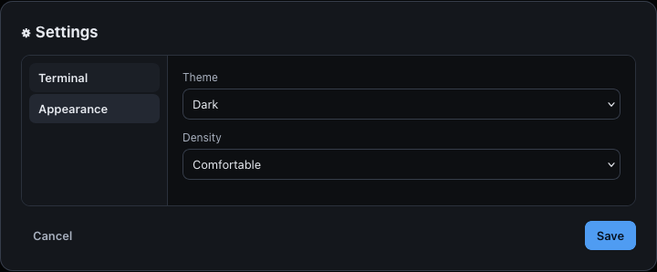

# Review: VS Code-like Categorised Settings

## Summary

The Settings modal is now a two-pane, registry-driven panel: a category rail on
the left, the selected category's settings on the right. One category ships
(**Terminal**), holding the font-family / font-size / ligatures fields moved
verbatim out of the old flat form. `pnpm test`, `pnpm lint` and `pnpm build`
pass, and every claim below is backed by a screenshot captured from the running
app rather than by reading the diff.

## Visual evidence

All images and the video are produced by `e2e/settings-screens.spec.js` against
the real app (Firefox, stub tool, 1440×900). Every shot doubles as an
assertion — a drifted layout fails the test before it can write a misleading
picture. Regenerate with:

```bash
npx playwright test e2e/settings-screens.spec.js
```

### Walkthrough (video)

Open Settings → rail + Terminal pane → pick "Custom…" → type a font CSS value →
set size 18 → tick ligatures → Save → reopen (values persisted, first category
active again) → Cancel discards.


Full-quality H.264: [`review-assets/settings-walkthrough.mp4`](review-assets/settings-walkthrough.mp4) (14s, 1280×800).

### 1 — the panel in the app

Two panes inside a wide modal, rail carrying the category name, no leftover
inline "Terminal" heading.





### 2 — Terminal fields still behave

"Custom…" reveals the free-text font CSS input:



Size and ligatures edited in the draft:



Reopened after Save — values persisted, and a stored non-preset font opens with
the custom input already showing:


### 3 — `wide` is opt-in, other modals unchanged

New-task modal, still `min(440px, 92vw)` — measured at 440px in the same run:



### 4 — extensibility, shown not asserted

`e2e/harness/settings-two.jsx` feeds the *same, untouched* `SettingsModal` a
stubbed two-entry registry (`Terminal` + a dummy `Appearance` panel). The rail
grows by one and the pane swaps:





## Acceptance checklist

| # | Criterion | Status | Evidence |
|--:|-----------|:--:|----------|
| 1 | Two panes: category rail left, settings right | ✅ | shots 01–02 |
| 2 | One rail entry per `CATEGORIES` entry ("Terminal") | ✅ | shot 02; spec asserts `toHaveCount(1)` |
| 3 | First category active on open, resets on reopen | ✅ | shot 05; spec re-checks `aria-current` after reopen |
| 4 | Active category visually distinct + `aria-current="page"` | ✅ | shots 02/08; asserted both ways in spec + unit test |
| 5 | `.modal.wide` = `min(720px, 92vw)`; other modals narrow | ✅ | measured 720 vs 440 in the run; shot 06 |
| 6 | Pane scrolls within a bounded height | ✅ | `.settings-pane { max-height: 420px; overflow-y: auto }` |
| 7 | Font presets + "Custom…" + free-text CSS input | ✅ | shot 03; spec asserts 7 presets + Custom… |
| 8 | Size input 8–32, clamps on save | ✅ | new unit test: 99 → 32 |
| 9 | Ligatures checkbox reflects + updates stored value | ✅ | shot 04; `bridza.term.ligatures` = `"1"` after Save |
| 10 | Save persists via `setTermSettings` and closes | ✅ | spec reads the three `bridza.term.*` keys back |
| 11 | Cancel / backdrop closes without saving | ✅ | spec edits size → Cancel → stored value unchanged |
| 12 | Live terminal update path unbroken | ✅ | `lib/settings.js` subscribers untouched; `term.jsx` unchanged |
| 13 | Redundant inline "Terminal" heading gone | ✅ | shot 02; spec asserts `.side-label` count 0 |
| 14 | A new category = one registry entry + its panel | ⚠️ | true for the shell — see finding 2 |
| 15 | Stubbed two-entry registry switches panes | ✅ | shots 07–08 + unit test |
| 16 | Out-of-scope items excluded | ✅ | no search box, reset, badges, scopes; `lib/settings.js` untouched |
| 17 | `settings-categories.test.jsx` covers rail / save / switching | ✅ | 4 tests |
| 18 | `pnpm test`, `pnpm lint`, `pnpm build` | ✅ | 234 tests pass · eslint clean · build ok |

## Findings

**1 — Ligatures checkbox sits flush against its label (cosmetic, pre-existing).**
Visible in shots 01/03/04: no gap, and the box aligns to the first text line.
`.field label { display: block }` (specificity 0-1-1) beats `.row`'s
`display: flex; gap: 8px` (0-1-0), so the row never becomes a flex row. The
markup is unchanged from before this task — the flat form had the same defect —
so it is not a regression. One-line fix if you want it in scope:
`.field label.row { display: flex; }`.

**2 — `SettingsModal` still knows the string `"terminal"` (follow-up, within spec).**
Draft seeding (`if (cat.id === "terminal") …`) and `save()` are terminal-specific.
A display-only category is genuinely a one-entry change; a category that must
*persist* will still edit `SettingsModal`. This is what the spec asked for
("keeps ownership of draft state and of `save`, which still calls
`setTermSettings`"), so it is not a defect — but criterion 14 is only fully true
for the second category once each entry carries its own `load`/`save`. Cheapest
future fix: `{ id, label, Panel, load, save }`, `save()` looping the registry.

Neither finding blocks merge.

## Files changed

| File | Change |
|------|--------|
| `src/app/features/settings.jsx` | `CATEGORIES` registry, `TerminalPanel`, two-pane `SettingsModal` |
| `src/app/ui.jsx` | optional `wide` prop on `Modal` |
| `src/app/bridza.css` | `.modal.wide`, `.settings-body`, `.settings-cats`, `.settings-pane` |
| `src/app/__tests__/settings-categories.test.jsx` | rail / persistence / switching / clamp (4 tests) |
| `e2e/settings-screens.spec.js` | review capture spec — the screenshots + video above |
| `e2e/harness/settings-two.jsx`, `.html` | dev-only two-category harness (not in the production bundle) |
| `review-assets/` | 8 screenshots + walkthrough mp4/gif |

## Over-engineering review

- Unused flexibility: none — the `Panel` registry is the feature.
- Reinvented stdlib: none.
- Abstractions with one caller: `TerminalPanel` is the only panel today, but the
  harness and unit test both exercise the second-entry path.
- To delete: nothing.

## Merge readiness

**Ready.** Behaviour verified in the real app, not just in jsdom; the two open
findings are cosmetic and forward-looking respectively, and neither touches the
shipped behaviour. `test-results/` and `*.bridza-tasks/` stay gitignored;
`review-assets/` is committed so the pictures survive in the history.
